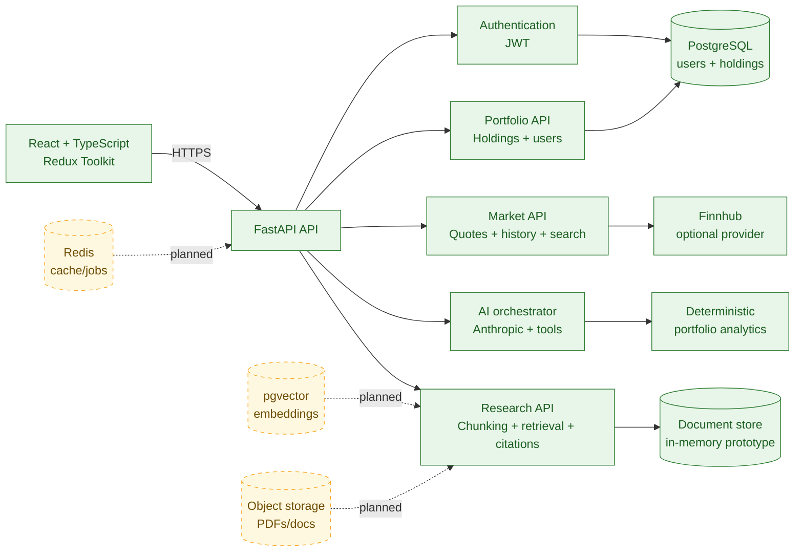

# FinVision

[](https://github.com/FarnazNK/finvision/actions/workflows/ci.yml)
[](https://www.python.org/)
[](https://fastapi.tiangolo.com/)
[](https://owasp.org/www-project-top-ten/)
[](https://www.docker.com/)

FinVision is an AI-assisted portfolio dashboard for monitoring holdings, market movements, transactions, allocation, and watchlists in one place. It combines a responsive React application with a FastAPI insights service that grounds answers in the portfolio snapshot supplied by the client.

> **Status:** The public frontend demo is live on GitHub Pages and the FastAPI service is live on Render with managed Neon PostgreSQL. The repository includes authenticated user accounts, portfolio persistence, optional Finnhub market-data integration, AI insights, and a document-retrieval prototype. External market-data and hosted LLM providers remain optional.

## Highlights

- Portfolio overview with value, return, day-change, allocation, and top-holdings KPIs
- Holdings, markets, transactions, and watchlist views
- Simulated live price feed with pause/resume controls and a synchronized equity curve for offline demos
- Light, dark, and system theme modes
- Currency display selection and transaction search
- Accessible UI primitives with keyboard navigation, labels, focus states, and reduced-motion support
- AI portfolio insights grounded in holdings and transaction data
- Document-grounded Research Assistant API with source citations
- Deterministic analytics tools and citations for auditable AI responses
- Offline AI fallback when no Anthropic API key is configured
- Dockerized frontend and AI service with nginx SPA routing
- GitHub Actions CI for frontend, backend, Compose, and production container builds
- GitHub Container Registry publishing for `main` and version tags
- Redux state persistence across browser refreshes
- PostgreSQL-compatible persistence, JWT authentication, and request metrics
- Public `/auth` sign-in and registration flow for user-scoped portfolio APIs
- SEO-ready public landing page at `/welcome` with Open Graph metadata and sitemap
- Portfolio profile guidance describing the information users can monitor and the AI-assisted research available to them
- Server-side Finnhub quote, history, and symbol-search adapters with caching

## Architecture



The frontend is a Vite-built single-page application. The AI service is isolated in `ai-service/` and exposes a small HTTP API. The model may call deterministic analytics tools for portfolio calculations; it does not receive permission to invent financial figures or perform unsupported arithmetic.

See [`ai-service/README.md`](./ai-service/README.md) for service-specific details.

### Frontend routes

| Route | Purpose |
| --- | --- |
| `/` | Portfolio dashboard demo |
| `/welcome` | Public product landing page |
| `/auth` | Sign-in and registration |
| `/holdings` | Holdings and position details |
| `/markets` | Market quotes, history, and symbol search |
| `/transactions` | Portfolio activity |
| `/watchlist` | Saved symbols and monitoring |

The diagram uses green for components implemented in this repository and dashed
yellow components for the next production milestone. Redis, pgvector, and object
storage are intentionally shown as planned integrations rather than claimed as
already operational.

### Research Assistant

The backend also includes a dependency-free retrieval vertical slice for financial
research documents. Documents are metadata-aware and split into bounded overlapping
chunks; `/api/research` returns ranked excerpts with source URLs and chunk IDs so
answers remain auditable. The current in-memory retriever is intentionally
deterministic for demos and CI, with a `Retriever` protocol ready for a
PostgreSQL/pgvector implementation.

```text
POST /api/research/ingest  -> document chunks + metadata
POST /api/research         -> ranked excerpts + citations
```

Research documents are not yet durable or user-scoped. Production RAG work still
requires pgvector, embedding generation, object storage, ingestion workers, and
retrieval/grounding evaluation.

## Public deployment status

The portfolio demo is deployed across GitHub Pages and Render:

- **Dashboard demo:** <https://farnaznk.github.io/finvision/>
- **Public landing page:** <https://farnaznk.github.io/finvision/welcome>
- **Sign-in and registration:** <https://farnaznk.github.io/finvision/auth>
- **FastAPI service:** <https://finvision-api.onrender.com>
- **API health:** <https://finvision-api.onrender.com/health>
- **Interactive API docs:** <https://finvision-api.onrender.com/docs>

The GitHub Pages build is configured to call the public Render API. The backend
uses managed PostgreSQL for authenticated portfolio persistence. Finnhub and
Anthropic remain optional integrations; without those provider keys the demo keeps
its simulated/offline behavior where supported.

### CI/CD and Docker images

Every pull request runs frontend type checking, linting, tests, a production
build, backend pytest, Compose validation, and production container builds.
Pushes to `main` publish these images to GitHub Container Registry:

```text
ghcr.io/farnaznk/finvision-web:latest
ghcr.io/farnaznk/finvision-ai-service:latest
```

Version tags such as `v1.0.0` also trigger the image-publishing workflow. Set the
repository variable `VITE_AI_SERVICE_URL` before publishing if the web image
should point at a hosted API. Publishing images is not the same as deploying
them; a hosting provider or orchestrator must still run the images with
production secrets and a managed PostgreSQL database.

Before deploying, configure:

1. A hosted PostgreSQL `DATABASE_URL`.
2. A long random `FINVISION_JWT_SECRET`.
3. A licensed `FINNHUB_API_KEY` if market data will be enabled.
4. `VITE_AI_SERVICE_URL` pointing to the deployed API before building the frontend.
5. `FINVISION_ALLOWED_ORIGINS` containing the deployed frontend origin.
6. `ANTHROPIC_API_KEY` only on the backend if hosted AI responses are enabled.

### Free deployment option

The repository includes a GitHub Pages workflow for the public frontend demo:

```text
https://farnaznk.github.io/finvision/
```

Enable Pages once in GitHub under **Settings → Pages → Source: GitHub Actions**.
Every push to `main` builds and publishes the dashboard, `/welcome` landing page,
authentication UI, and offline demo.
Set the repository variable `VITE_AI_SERVICE_URL` if the static demo should call
the separately hosted FastAPI service.

For an alternative free frontend deployment, use Vercel or Cloudflare Pages with:

```text
Build command: npm run build
Output directory: dist
Node.js: 20
```

After deployment, replace the `finvision.pages.dev` URLs in `index.html`,
`public/robots.txt`, and `public/sitemap.xml` with the actual site URL, then
submit that sitemap in Google Search Console. Search indexing is controlled by
Google and may take time; publishing a site does not guarantee ranking.

The repository also includes [render.yaml](./render.yaml) as reproducible Render
deployment configuration. The public FastAPI service is currently deployed at
<https://finvision-api.onrender.com> and uses managed Neon PostgreSQL. Provider
credentials are only required for the optional external integrations.

Do not claim the demo provides live market data until the provider plan permits
redistribution and the deployment displays the provider's required attribution
and delayed-data notice.

## Technology stack

- **Frontend:** React 18, TypeScript, Vite, Redux Toolkit, React Router, styled-components, Recharts
- **AI service:** Python 3.12, FastAPI, Pydantic v2, Anthropic SDK
- **Testing:** Jest, React Testing Library, pytest
- **Delivery:** Docker, Docker Compose, nginx
- **Quality:** TypeScript strict mode, ESLint, typed Redux hooks, CI via GitHub Actions

## Quick start

### Prerequisites

- Node.js 20 or newer
- npm
- Python 3.12 for running the service outside Docker
- Docker Desktop for the full-stack workflow

### Run locally with Docker Compose

These are local-development URLs on your own computer. They are not public
internet links and do not mean the application has been deployed.

The default configuration runs the web application on port `8080` and the AI service on port `8000`. Anthropic access is optional; without it, the service uses its deterministic offline response.

```bash
export ANTHROPIC_API_KEY=sk-...   # optional
export VITE_AI_SERVICE_URL=http://localhost:8000

docker compose up --build
```

Open:

- Local web application: <http://localhost:8080>
- Local AI service health: <http://localhost:8000/health>
- Local interactive API docs: <http://localhost:8000/docs>

On Windows PowerShell, run the equivalent commands below from the repository root:

```powershell
# Optional: set this only if you have an Anthropic API key.
$env:ANTHROPIC_API_KEY = 'sk-your-key'
$env:VITE_AI_SERVICE_URL = 'http://localhost:8000'
docker compose up --build
```

Once the containers are ready, open the same local URLs listed above:

- Web application: <http://localhost:8080>
- AI service health: <http://localhost:8000/health>
- Interactive API docs: <http://localhost:8000/docs>

### Run the frontend locally

```bash
npm ci
npm run dev
```

The Vite development server listens on port `3000`.

### Run the AI service locally

```bash
cd ai-service
python -m venv .venv
# Activate the virtual environment using the command for your shell.
pip install -r requirements-dev.txt
uvicorn app.main:app --reload
```

When running the service locally, execute commands from `ai-service` or set `PYTHONPATH` to that directory so the `app` package can be imported.

## Configuration

The frontend value `VITE_AI_SERVICE_URL` is embedded into the browser bundle at build time. Set it to the public AI service URL before building the web image.

The AI service supports these environment variables:

| Variable | Purpose | Default |
| --- | --- | --- |
| `ANTHROPIC_API_KEY` | Enables Anthropic-backed responses | Empty / offline mode |
| `FINVISION_MODEL` | Anthropic model identifier | `claude-sonnet-5` |
| `FINNHUB_API_KEY` | Enables server-side Finnhub market endpoints | Empty / disabled |
| `DATABASE_URL` | SQLAlchemy database URL for users and portfolios | Local SQLite |
| `FINVISION_JWT_SECRET` | JWT signing secret for user authentication | Development-only fallback |
| `FINVISION_MARKET_CACHE_TTL` | Market response cache duration in seconds | `30` |
| `FINVISION_MARKET_TIMEOUT` | Finnhub request timeout in seconds | `8` |
| `FINVISION_ALLOWED_ORIGINS` | Comma-separated CORS origins | Local ports `3000` and `8080` |
| `FINVISION_API_KEY` | Optional bearer-token protection for `/api/insights` | Empty / disabled |
| `FINVISION_RATE_LIMIT` | Requests per client per minute | `30` |
| `FINVISION_REQUEST_TIMEOUT` | Anthropic request timeout in seconds | `20` |

**Security:** Never put a shared production secret in a `VITE_*` variable. Vite embeds those values in public browser JavaScript. Use a server-side proxy, private service networking, or user-scoped authentication for production deployments.

The web container includes an nginx `try_files` fallback, so direct navigation and browser refreshes on routes such as `/holdings`, `/markets`, and `/transactions` continue to serve the SPA entry point.

## Available scripts

```bash
npm run dev                    # Start Vite on port 3000
npm run typecheck              # TypeScript check
npm run lint                   # ESLint
npm test -- --runInBand        # Frontend tests
npm run build                  # Production frontend build
```

Backend tests:

```bash
cd ai-service
python -m pytest -v
```

## Local verification checklist

Run the following before publishing a change:

```bash
npm run typecheck
npm run lint
npm test -- --runInBand
npm run build
cd ai-service
python -m pytest -v
cd ..
docker compose config
docker compose build
```

For a runtime smoke test:

1. Start Docker Compose locally.
2. Open `/holdings` directly at `http://localhost:8080/holdings` and refresh the page.
3. Confirm `http://localhost:8000/health` returns `{"status":"ok"}`.
4. Ask a question in the Overview page's Insights panel.
5. Confirm the portfolio value and equity curve respond to live-feed ticks.

## Repository layout

```text
src/
+-- app/             Store configuration and typed Redux hooks
+-- components/      Layout, charts, and reusable UI primitives
+-- features/        Portfolio, markets, transactions, watchlist, UI, insights
+-- hooks/           Application hooks such as useMarketFeed
+-- pages/           Overview, Holdings, Markets, Transactions, Watchlist
+-- services/        Market feed, seed data, and AI client
+-- theme/           Design tokens and global styling
+-- test/            Shared test setup and rendering helpers
+-- types/           Shared domain types
+-- utils/           Formatting and responsive helpers

ai-service/
+-- app/             FastAPI entrypoint, schemas, analytics, and LLM orchestration
+-- tests/           API and analytics tests
```

## Product and production considerations

This repository intentionally uses seed holdings and a simulated market feed. A production financial product would additionally require authenticated user accounts, durable per-user storage, real market-data licensing, broker or manual holdings ingestion, subscription and billing controls, operational monitoring, privacy and terms documentation, and a professional legal/compliance review.

The insights feature is descriptive rather than a source of personalized investment advice. Do not use the prototype as a substitute for professional financial guidance.

## License

The repository includes a restrictive source-available [LICENSE](./LICENSE).
Review is permitted, but copying, redistribution, modification, and commercial
use require permission. This legal license does not technically hide code that
is delivered to a browser; keep secrets, credentials, prompts, and proprietary
data on the backend.